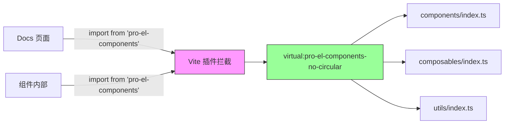

# 循环引用问题解决方案

## 问题描述

项目中存在循环引用问题：

1. `src/index.ts` 导入并重新导出所有组件
2. 某些组件（如 `ProTableModal`）内部从 `pro-el-components` 导入其他组件
3. `pro-el-components` 通过 alias 指向 `src/index.ts`
4. 形成循环：`index.ts` → 组件 → `pro-el-components` → `index.ts`

## 为什么不能改为相对路径？

组件内部必须使用 `pro-el-components` 而不是相对路径，原因是：

- 打包时需要将 `pro-el-components` 标记为 external
- 这样用户安装后可以按需导入组件，不会重复打包
- 如果使用相对路径，打包后所有依赖都会被内联，导致包体积过大

## 解决方案

### 1. Vite 配置 - 使用虚拟模块（适用于 docs/开发环境）

在 `docs/.vitepress/config.mts` 中添加自定义插件：

```typescript
// 解决循环引用的插件 - 将所有对 pro-el-components 的导入重定向到虚拟模块
function resolveCircularImportsPlugin() {
  const srcPath = path.resolve(__dirname, '../../packages/components/src')

  return {
    name: 'resolve-circular-imports',
    enforce: 'pre' as const,
    resolveId(source: string, importer: string | undefined) {
      // 拦截所有对 pro-el-components 的导入（不带子路径）
      if (source === 'pro-el-components') {
        // 直接返回虚拟模块，完全跳过 index.ts，避免循环引用
        return {
          id: 'virtual:pro-el-components-no-circular',
          moduleSideEffects: false,
        }
      }

      return null
    },
    load(id: string) {
      // 为虚拟模块提供内容，直接重新导出所有内容
      // 不加载 index.ts，直接从各自的导出文件导出
      if (id === 'virtual:pro-el-components-no-circular') {
        return `// 虚拟模块，避免循环引用
export * from '${srcPath}/components/index.ts'
export * from '${srcPath}/composables/index.ts'
export * from '${srcPath}/utils/index.ts'

// 提供默认导出用于全局注册（如果需要）
// 注意：docs 环境通常不需要全局注册
export default {
  install: () => {
    console.warn('pro-el-components: 全局注册在 docs 环境中被禁用以避免循环引用')
  }
}`
      }
      return null
    },
  }
}
```

**关键点**：此插件拦截**所有**对 `pro-el-components` 的导入（包括 docs 页面中的导入），完全跳过 `src/index.ts`，从而彻底避免循环引用。

### 2. Alias 配置

配置 alias 支持子路径导入（如样式文件）：

```typescript
resolve: {
  alias: [
    // 子路径 alias - 用于处理样式文件等资源导入
    {
      find: /^pro-el-components\/components\/(.+)$/,
      replacement: `${path.resolve(__dirname, '../../packages/components/src/components')}/$1`,
    },
    {
      find: /^pro-el-components\/composables\/(.+)$/,
      replacement: `${path.resolve(__dirname, '../../packages/components/src/composables')}/$1`,
    },
    // 注意：主路径 pro-el-components 由 Vite 插件处理，不在这里配置
    // 这样可以避免加载 index.ts 导致的循环引用
    {
      find: '@/',
      replacement: `${path.resolve(__dirname, '../../packages/components/src')}/`,
    },
  ],
},
```

**重要**：主路径 `pro-el-components` 不在 alias 中配置，而是由 Vite 插件处理。

### 3. 优化配置

```typescript
// 排除 pro-el-components 的预构建，强制使用 alias
optimizeDeps: {
  exclude: ['pro-el-components'],
},
// 确保 pro-el-components 只被解析一次
dedupe: ['pro-el-components'],
```

### 4. 打包配置 - External 标记（components 包）

在 `packages/components/vite.config.mts` 中：

```typescript
const external = [
  'vue',
  'element-plus',
  '@vueuse/core',
  'lodash-es',
  'vue-router',
  'vue-i18n',
  'pro-el-components', // 重要：将自身标记为 external
  // ... 其他依赖
]
```

## 工作原理

### 1. 开发/文档环境（docs）

当在 docs 中运行开发服务器或构建时：

1. **任何地方**导入 `pro-el-components` 时（包括 docs 页面、组件内部），Vite 插件都会拦截
2. 返回虚拟模块 `virtual:pro-el-components-no-circular`
3. 虚拟模块直接从 `components/index.ts`、`composables/index.ts` 等导出
4. **完全跳过 `src/index.ts`**，从而彻底避免循环引用



**关键**：`src/index.ts` 在 docs 环境中永远不会被加载，所以不会触发循环引用。

### 2. 打包环境（packages/components）

组件库打包时：

- `pro-el-components` 被标记为 external
- 组件内部的 `import from 'pro-el-components'` 保留在打包后的代码中
- **不会触发循环引用**，因为是静态分析，不执行代码

### 3. 用户使用环境

用户安装 `pro-el-components` 后：

**方式一：按需导入（推荐）**
```typescript
import { ProSearchForm, ProTable } from 'pro-el-components'
```
- 直接从打包后的 dist 导入，没有循环引用问题
- Tree-shaking 友好

**方式二：全局注册**
```typescript
import ProElComponents from 'pro-el-components'
app.use(ProElComponents)
```
- `install` 函数是同步的，使用体验完全正常
- 所有组件已经被打包好，没有循环引用

## 关键点

✅ **组件源码**：可以继续使用 `import from 'pro-el-components'`
✅ **组件打包**：`pro-el-components` 保持 external，不打包进 dist
✅ **docs 环境**：通过虚拟模块完全避免循环引用，开发和构建都正常
✅ **用户使用**：完全不受影响，`install` 函数是同步的，使用体验正常
✅ **子路径导入**：支持 `pro-el-components/components/Table/style.css` 等

## 对用户使用的影响

**完全没有影响！** 用户使用组件库时：

1. **按需导入** - 正常工作，Tree-shaking 有效
   ```typescript
   import { ProSearchForm, ProTable } from 'pro-el-components'
   ```

2. **全局注册** - 完全同步，无需 async/await
   ```typescript
   import ProElComponents from 'pro-el-components'
   app.use(ProElComponents) // 同步调用，立即生效
   ```

3. **打包后的代码** - 所有组件已经被正确打包，没有循环引用

## 测试

```bash
# 测试 docs 构建
pnpm docs:build

# 测试 docs 开发
pnpm docs:dev

# 测试 components 打包
cd packages/components
pnpm build
```
