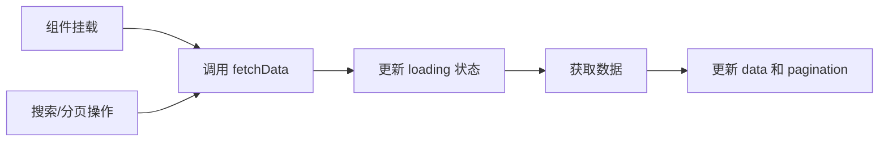

# useTableList

> 🚀 专为列表页设计的数据管理 Hook，集成分页、搜索、加载状态管理，让列表页开发更轻松。

## ✨ 核心特性

- **📊 分页管理** - 自动处理分页逻辑，支持页码和每页数量控制
- **🔍 搜索集成** - 内置搜索表单数据管理和提交重置逻辑
- **⏳ 加载状态** - 自动管理加载状态，提供良好的用户体验
- **🔄 自动刷新** - 提供便捷的数据刷新方法
- **⚡ 防抖优化** - 内置防抖机制，避免频繁请求
- **🎯 TypeScript** - 完整的类型支持，提供优秀的开发体验

## 🎯 适用场景

- **用户管理页面** - 用户列表的增删改查
- **订单管理系统** - 订单列表的筛选和分页
- **商品管理后台** - 商品列表的搜索和管理
- **数据看板** - 各种数据列表的展示

## 🚀 快速开始

### 基础用法

<demo src="@/composables/useTableList/demos/demo1.vue" />

### 高级用法

<demo src="@/composables/useTableList/demos/demo2.vue" />

### 完整示例

<demo src="@/composables/useTableList/demos/demo3.vue" />

## 💡 核心概念

### 数据流程



### 状态管理

useTableList 管理以下状态：

- **data** - 当前页的数据列表
- **loading** - 加载状态标识
- **pagination** - 分页信息（当前页、每页数量、总数等）
- **searchData** - 搜索表单的数据

## 🔧 API 详解

### 函数签名

```typescript
function useTableList<T = any>(
  service: UseTableListService<T>,
  options?: UseTableListOptions
): UseTableListReturn<T>
```

### Service 函数

```typescript
type UseTableListService<T> = (
  params: {
    pageNo: number // 当前页码
    pageSize: number // 每页数量
    [key: string]: any // 其他搜索参数
  },
  options: {
    mergeParams?: boolean // 是否合并参数
    debounce?: boolean // 是否启用防抖
  }
) => Promise<{
  data: T[] // 数据列表
  total: number // 总数量
  [key: string]: any // 其他返回数据
}>
```

### Options 配置

| 参数              | 类型                  | 默认值                            | 描述                                           |
| ----------------- | --------------------- | --------------------------------- | ---------------------------------------------- |
| `immediate`       | `boolean`             | `true`                            | 是否在组件挂载时立即加载数据                   |
| `form`            | `FormInstance`        | -                                 | 表单实例，可选，用于重置表单, 如不传则自动生成 |
| `defaultPageSize` | `number`              | `10`                              | 默认每页数量                                   |
| getTotal          | (data: any) => number | (data: any) => data?.value?.total | 否                                             | 定义如何获取请求返回列表数据的total |
| getList           | (data: any) => any[]  | (data: any) => data?.value?.data  | 否                                             | 定义如何获取请求返回列表数据的total |
| onReset           | () => any             |                                   | 否                                             | 自定义清空处理                      |
| mergeData         | () => any             |                                   | 否                                             | 自定义清空处理                      |

### 返回值

| 属性            | 类型                                                                       | 描述                                   |
| --------------- | -------------------------------------------------------------------------- | -------------------------------------- |
| `data`          | `Ref<T[]>`                                                                 | 当前页数据列表                         |
| `loading`       | `Ref<boolean>`                                                             | 加载状态                               |
| `searchData`    | `Ref<Record<string, any>>`                                                 | 提交的搜索表单数据                     |
| `searchState`   | `Ref<Record<string, any>>`                                                 | 实时搜索表单数据                       |
| `search.submit` | `Function`                                                                 | 提交搜索，重置到第一页                 |
| `search.reset`  | `Function`                                                                 | 重置搜索条件和表单                     |
| `refresh`       | `Function`                                                                 | 刷新当前页数据                         |
| `fetchData`     | `Function`                                                                 | 手动获取数据                           |
| `loadNextPage`  | `Function`                                                                 | 加载下一页数据                         |
| currentPage     | number                                                                     | 当前页码                               |
| pageSize        | number                                                                     | 每页显示的行数                         |
| total           | number                                                                     | 数据总数                               |
| changePageNo    | function                                                                   | 页码改变回调                           |
| changePageSize  | function                                                                   | 每页行数改变回调                       |
| onSortChange    | `(data: {column: any, sortBy: string, prop: string, order: any }) => void` | 用于sortChange事件                     |
| `pagination`    | `Ref<PaginationProps>`                                                     | 分页配置对象, 可直接用于 ProTable 组件 |
| reset           | `({ reFetchData?: boolean } = {}) => void`                                 | 重置搜索表单并自动刷新列表             |
| searchFormRef   | ref                                                                        | 当前搜索表单ref                        |

## 💻 使用示例

### 完整的列表页实现

```vue
<script setup lang="ts">
import { useTableList } from 'pro-el-components'
import { ref } from 'vue'

// 表单引用
const searchFormRef = ref()

// 用户数据类型定义
interface UserItem {
  id: number
  username: string
  email: string
  status: 'active' | 'inactive'
  createdAt: string
}

// 数据获取函数
async function fetchUserList(params: any) {
  const response = await api.getUserList(params)
  return {
    data: response.data.list,
    total: response.data.total
  }
}

// 使用 useTableList 管理状态
const {
  data,
  loading,
  pagination,
  searchData,
  search: { submit, reset }
} = useTableList<UserItem>(fetchUserList, {
  form: searchFormRef, // 传入表单引用用于重置
  defaultPageSize: 20,
  defaultParams: { status: 'active' }
})

// 搜索表单配置
const searchFields = [
  {
    label: '用户名',
    prop: 'username',
    component: 'input',
    fieldProps: { placeholder: '请输入用户名' }
  },
  {
    label: '邮箱',
    prop: 'email',
    component: 'input',
    fieldProps: { placeholder: '请输入邮箱' }
  },
  {
    label: '状态',
    prop: 'status',
    component: 'select',
    options: [
      { label: '激活', value: 'active' },
      { label: '禁用', value: 'inactive' }
    ]
  }
]

// 表格列配置
const columns = [
  { label: 'ID', prop: 'id', width: 80 },
  { label: '用户名', prop: 'username' },
  { label: '邮箱', prop: 'email' },
  {
    label: '状态',
    prop: 'status',
    renderAs: 'enum',
    fieldProps: {
      options: [
        { label: '激活', value: 'active', status: 'success' },
        { label: '禁用', value: 'inactive', status: 'danger' }
      ]
    }
  },
  {
    label: '创建时间',
    prop: 'createdAt',
    renderAs: 'date',
    fieldProps: { format: 'YYYY-MM-DD HH:mm:ss' }
  },
  {
    label: '操作',
    actions: [
      { text: '编辑', onClick: handleEdit },
      { text: '删除', onClick: handleDelete, danger: true }
    ]
  }
]

// 事件处理
function handleSearch(params: any) {
  submit(params)
}

function handleReset() {
  reset()
}

function handleEdit(row: UserItem) {
  console.log('编辑用户:', row)
}

function handleDelete(row: UserItem) {
  console.log('删除用户:', row)
}
</script>

<template>
  <div class="user-list-page">
    <!-- 搜索表单 -->
    <SearchForm
      ref="searchFormRef"
      :fields="searchFields"
      :search="{ submit: handleSearch, reset: handleReset }"
      :default-value="searchData"
    />

    <!-- 数据表格 -->
    <ProTable
      :columns="columns"
      :data="data"
      :loading="loading"
      :pagination="pagination"
    />
  </div>
</template>
```

## ⚠️ 注意事项

> **重要提醒**
> 1. 如果使用重置功能，`searchForm` 需要关联 `searchFormRef`，以使用 `resetFields` 方法清空表单
> 2. `fetchData` 方法默认启用防抖机制，避免频繁请求
> 3. 分页参数使用 `pageNo` 和 `pageSize`，请确保后端接口参数匹配

## 🔗 相关链接

- [ProTable](/components/Table) - 配套的高级表格组件
- [SearchForm](/components/SearchForm) - 搭配使用的搜索表单
- [Vue 3 Composition API](https://vuejs.org/guide/extras/composition-api-faq.html) - 了解组合式 API 基础
